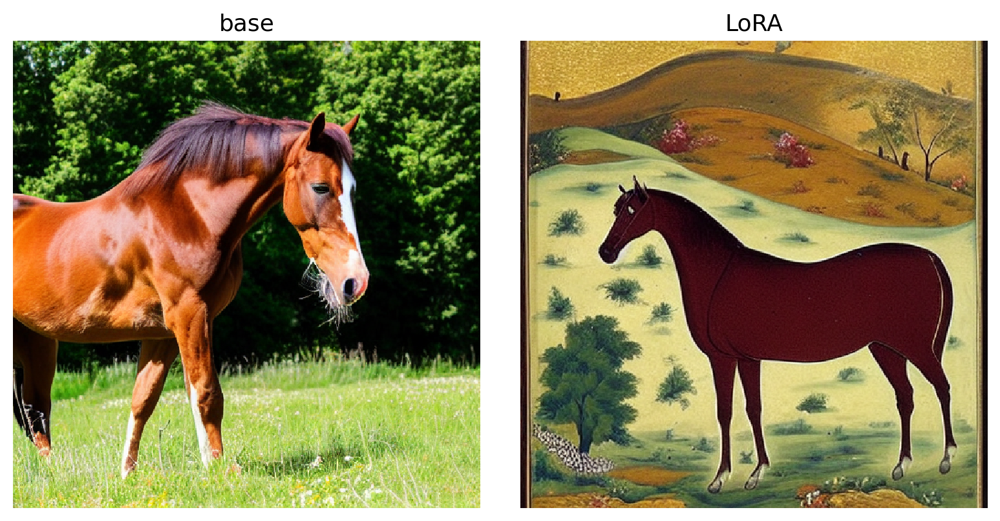

# Stable Diffusion 1.5 reimplemented from scratch in PyTorch and LoRA finetuned on Persian miniature paintings

<p align="center">
  
  
  
</p>

A from-scratch reimplementation of Stable Diffusion 1.5 in PyTorch: the VAE, CLIP text
encoder, UNet, and samplers are all built by hand (no `diffusers`). I did not pretrain 
the base model from scratch; I instead loaded the checkpoint. I then LoRA-finetuned
the base model into a Persian-miniature style adapter.

## Components

- From-scratch base model: CLIP text encoder, VAE, and UNet (self/cross attention + FFN)
- Samplers: DDPM and DDIM implemented from scratch, Euler sampler is in progress
- LoRA: low rank adapter linear layers with training code
- txt2img and img2img inference
- Persian-miniature LoRA: trained on scraped and cleaned images from Wikimedia Commons

## Results

### How I ran experiments

I wanted to test how varying configurations of LoRA layers affect the adapter's ability to
learn the flat and decorative style of Persian miniatures while still reflecting the prompt.
To do so, I finetuned LoRA adapters varying three degrees of freedom between experiments: rank
(`r`) (adapter capacity), alpha (the `alpha / r` scaling in the LoRA update), and target layers
(which layers in the base model get an attached LoRA layer, e.g. q/k/v/out proj self-attention 
layers). Each run is scored by `scripts/evaluate_lora.py`, which generates images on a fixed set
of prompts and computes the three metrics below:
  1. Val-loss ratio: LoRA / base model noise prediction MSE on held-out eval images (< 1.0 is better)
  2. Prompt adherence: avg. cosine similarity between the CLIP embeddings of generated images and their eval prompts (higher = matches prompt better)
  3. Style adherence: avg. cosine similarity between the CLIP embeddings of generated images and the mean CLIP embedding of the held-out eval images (higher = closer to the Persian-miniature style)

The per-experiment metrics are as follows (each row is an experiment):

| r | α | Target layers | Val-loss ratio | Prompt adh. | Style adh. |
|---|---|---|---|---|---|
| — | — | base (no adapter) | 1.0000 | 0.312 | 0.545 |
| 16 | 8 | self-attn | 0.9924 | 0.313 | 0.680 |
| 16 | 8 | cross-attn | 0.9948 | 0.290 | 0.737 |
| 16 | 8 | self + cross | 0.9941 | 0.289 | 0.725 |
| 16 | 16 | self + cross | 0.9984 | 0.290 | 0.710 |
| **16** | **8** | **self + cross + FFN** | **0.9933** | **0.303** | **0.747** |
| 32 | 16 | self-attn | 0.9934 | 0.304 | 0.734 |
| 32 | 16 | cross-attn | 0.9961 | 0.278 | 0.719 |
| 32 | 16 | self + cross | 0.9970 | 0.278 | 0.757 |
| 32 | 32 | self + cross | 1.0072 | 0.267 | 0.630 |
| 32 | 16 | self + cross + FFN | 0.9981 | 0.284 | 0.738 |


### Winning configuration

The winning configuration was r16, alpha 8, with LoRA layers injected into the self-attention and cross-attention projections and the FFN linear layers. A few patterns showed up across the experiments. Small corrections (a low alpha relative to r) looked the best visually regardless of rank, while high capacity paired with a high correction (r32, alpha 32) was oversaturated and came out worst on every metric, with the lowest style adherence, the lowest prompt adherence, and the only val-loss ratio above 1.0. Regarding where to inject LoRA layers, only self-attention did not learn the style very well, which follows because cross-attention is where information flows between the image and the prompt. Cross-attention alone did learn the style well, and adding self-attention and the FFN on top of it performed better. On the metrics, the base model has close to the best prompt adherence and the lowest style adherence by a clear margin, which is the tradeoff I expected since the adapter pulls the outputs toward the Persian miniature style at a small cost to prompt adherence. r16 alpha 8 found the best balance of the two. It is one of the best on both metrics without being the single best on either, and it also looked the best visually, with r32 alpha 16 being a close contender. I did not pick the run with the highest style adherence because it sacrificed too much prompt adherence, while r16 alpha 8 was both better balanced and nicer to look at.

 
**Base vs. LoRA** (LoRA r16 alpha 8 self + cross + FFN, same prompt and seed):

<p align="center">
  
  <br>
  <sub>prompt: "a horse standing in a meadow", seed 1</sub>
</p>

## Quickstart

Requires Python ≥ 3.11 and [uv](https://docs.astral.sh/uv/).

```bash
# 1. clone and install
git clone https://github.com/HarshaSrirangam/stable-diffusion-rebuilt.git
cd stable-diffusion-rebuilt
uv sync

# 2. download the base SD1.5 checkpoint + Persian LoRA weights (into data/weights/)
uv run python scripts/download_data.py

# 3. edit configs/inference.yaml (prompt, sampler, seed, lora_path, ...), then generate
uv run python scripts/generate.py
```

Generated images are written to `outputs/out<N>/` along with a snapshot of the config used.
Set `lora_path: null` in `configs/inference.yaml` to run the base model instead of the LoRA.
Point `input_image` to a file path for img2img, leave as `null` for txt2img. See `notebooks/inference_demo.ipynb` for a walkthrough.

## Reproducing the LoRA adapter

```bash
# build the dataset (scrape, filter, caption), or download the published parquet dataset from HuggingFace
#   see notebooks/build_dataset.ipynb  (GPU recommended for captioning)

# train a LoRA run (edit configs/lora.yaml, writes to runs/<name>/)
uv run python scripts/train_lora.py

# evaluate a run (metrics + eval grid, writes to runs/<run>/eval/)
uv run python scripts/evaluate_lora.py --run <run_name>

# export a run's checkpoint
uv run python scripts/export_lora.py --run <run_name> --out persian_lora.safetensors
```

## Repo structure

```
stable-diffusion-rebuilt/
├── src/sdrebuilt/
│   ├── model/             # from-scratch VAE, CLIP text encoder, UNet
│   ├── samplers/          # DDPM, DDIM (Euler in progress)
│   ├── lora/              # LoRA layers and utility functions
│   ├── inference.py       # txt2img / img2img pipeline
│   ├── trainer.py         # LoRA training loop
│   ├── dataset.py         # image/caption dataset
│   └── convert_weights.py # load SD1.5 checkpoint into the custom SD modules in model/
├── scripts/
│   ├── scrape.py          # scrape Persian miniatures from Wikimedia Commons
│   ├── filter_persian.py  # junk filtering
│   ├── caption.py         # BLIP captioning and cleanup
│   ├── train_lora.py      # train a LoRA run, reads configs/lora.yaml
│   ├── evaluate_lora.py   # metrics and eval grid for a run
│   ├── export_lora.py     # export a run's checkpoint as a .safetensors
│   ├── generate.py        # generate image with LoRA run or base model
│   └── download_data.py   # download base SD1.5 and Persian LoRA weights from HF
├── configs/               # inference.yaml, lora.yaml, samplers.yaml
├── notebooks/             # build_dataset, train, inference_demo
└── assets/                # README images
```

## Data and weights

- LoRA weights: [`HarshaSrirangam/persian-miniature-lora`](https://huggingface.co/HarshaSrirangam/persian-miniature-lora)
- Dataset: [`HarshaSrirangam/persian-miniatures`](https://huggingface.co/datasets/HarshaSrirangam/persian-miniatures)

Images were scraped from [Wikimedia Commons](https://commons.wikimedia.org/wiki/Category:Persian_miniatures)
(~6.8k scraped, filtered to ~5.2k, then captioned and published as parquet)

## Acknowledgements

- Rombach et al., [High-Resolution Image Synthesis with Latent Diffusion Models](https://arxiv.org/abs/2112.10752) (Stable Diffusion)
- Base model weights (`v1-5-pruned-emaonly.safetensors`): [`stable-diffusion-v1-5`](https://huggingface.co/stable-diffusion-v1-5/stable-diffusion-v1-5)
- Hu et al., [LoRA: Low-Rank Adaptation of Large Language Models](https://arxiv.org/abs/2106.09685)
- Ho et al., [Denoising Diffusion Probabilistic Models](https://arxiv.org/abs/2006.11239) (DDPM)
- Song et al., [Denoising Diffusion Implicit Models](https://arxiv.org/abs/2010.02502) (DDIM)
- Radford et al., [Learning Transferable Visual Models From Natural Language Supervision](https://arxiv.org/abs/2103.00020) (CLIP)
- Li et al., [BLIP: Bootstrapping Language-Image Pre-training](https://arxiv.org/abs/2201.12086) (used to caption the dataset)

## License

[MIT](LICENSE)